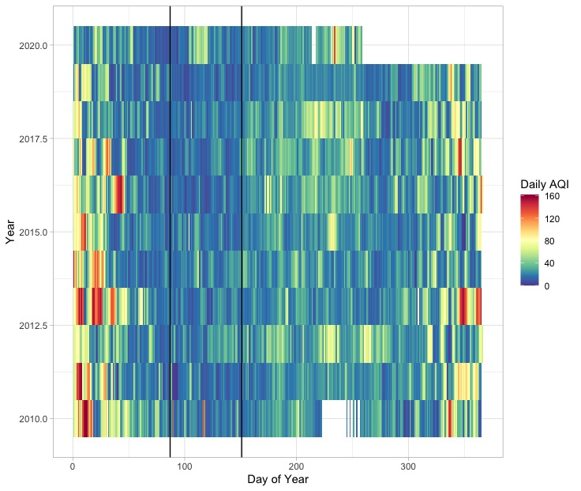
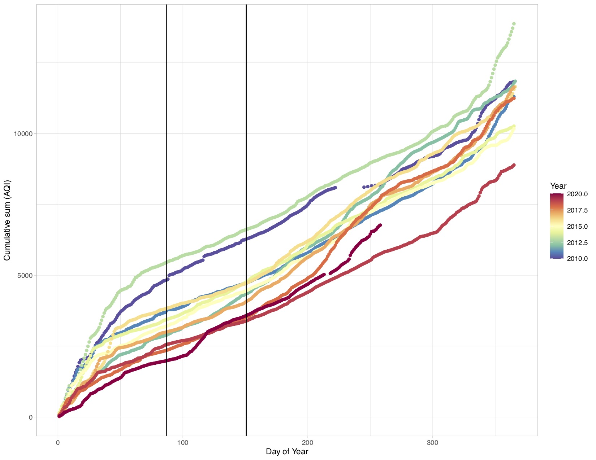
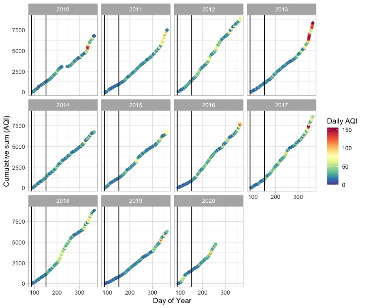

# Salt Lake City Air quality
This script was written to explore the potential for there to be significant air quality affects from the early 2020 covid lockdowns.

There was a distinctive period in the spring of 2020 when Salt Lake City experienced very little vehicular traffic, which is known as the number one contributor to the valley's inversions. I wanted to conduct a simple visual data visualization to see whether or not there were significant effects from this lockdown period.  

I accessed data from the EPA [data](https://www.epa.gov/outdoor-air-quality-data)

My first experiment was to look at a heatmap of the airquality index parsed by year.

The black lines are the period in days of the year wherein there was a significant lockdown in Salt Lake City.  For 2020, there's no significant improvement in AQI during this period, maybe even an increase in AQI (decrease in air quality).

I also explored several cumulative plot methods for exploring this dataset:

In this cumulative plot, 2020 is the redmost line which again doesn't have the lowest values compared with 2019 or even 2018.

A few more plots below:

